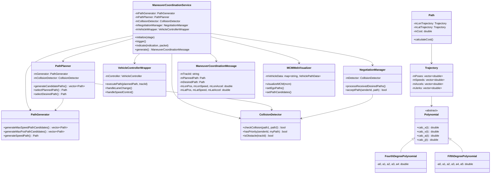
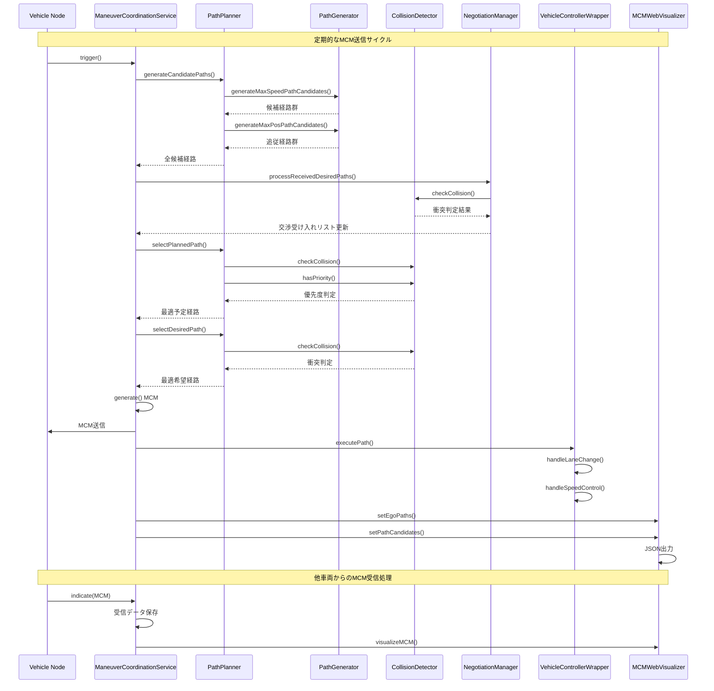

# Maneuver Coordination Service (MCS)

## 概要

Maneuver Coordination Service (MCS) は、V2X通信を用いて車両間で経路情報を共有し、協調的な運転操作を実現するシステムです。各車両は自身の予定経路と希望経路をManeuver Coordination Message (MCM)として送信し、受信した情報を基に衝突回避と最適な経路選択を行います。

## 主な機能

- **経路共有**: 車両の現在状態（位置、速度、加速度）と将来経路の共有
- **協調制御**: 予定経路（Planned Path）と希望経路（Desired Path）による柔軟な調整
- **衝突回避**: 他車両との衝突判定と優先度に基づく経路調整
- **リアルタイム可視化**: Webブラウザでの経路表示
- **多項式軌跡**: 滑らかで快適な軌跡生成

## システムアーキテクチャ

### クラス図



### シーケンス図



## ファイル構成

```
src/artery/application/mcs/
├── ManeuverCoordinationService.h        # メインサービスクラス
├── ManeuverCoordinationService.cc
├── ManeuverCoordinationService.ned      # OMNeT++ネットワーク定義
├── ManeuverCoordinationMessage.h        # MCMメッセージクラス
├── ManeuverCoordinationMessage.cc
├── PathPlanner.h                        # 高レベル経路計画
├── PathPlanner.cc
├── PathGenerator.h                      # 基本経路生成
├── PathGenerator.cc
├── CollisionDetector.h                  # 衝突判定
├── CollisionDetector.cc
├── NegotiationManager.h                 # 交渉管理
├── NegotiationManager.cc
├── VehicleControllerWrapper.h           # 車両制御ラッパー
├── VehicleControllerWrapper.cc
├── Path.h                              # 経路クラス
├── Path.cc
├── Trajectory.h                        # 軌跡クラス
├── Trajectory.cc
├── Polynomial.h                        # 多項式基底クラス
├── FourthDegreePolynomial.h            # 4次多項式
├── FourthDegreePolynomial.cc
├── FifthDegreePolynomial.h             # 5次多項式
├── FifthDegreePolynomial.cc
├── MCMWebVisualizer.h                  # Web可視化
└── MCMWebVisualizer.cc
```

## 設定パラメータ

### ManeuverCoordinationService.ned

| パラメータ | 型 | デフォルト値 | 説明 |
|-----------|---|-------------|------|
| `vehicleLength` | double | 5m | 車両長 |
| `numLanes` | int | 3 | レーン数 |
| `laneWidth` | double | 3.2m | レーン幅 |
| `convergenceTime` | double | 5s | 経路の時間幅 |
| `desiredCostThreshold` | double | 100.0 | 希望経路選択のコスト閾値 |
| `safetySecond` | double | 2.0s | 安全秒数 |
| `laneChangeInterval` | double | 5.0s | 車線変更間隔 |
| `enableVisualization` | bool | true | 可視化有効フラグ |
| `visualizationPort` | int | 8080 | 可視化用ポート |

### コスト関数パラメータ (Path.h)

| パラメータ | 値 | 説明 |
|-----------|---|------|
| `K_JERK` | 0.1 | ジャークの重み |
| `K_SPEED` | 5.0 | 速度の重み |
| `K_LON` | 1.0 | 縦方向の重み |
| `K_LAT` | 1.0 | 横方向の重み |

## シミュレーションの実行方法

### 1. シナリオファイルの設定

```ini
# omnetpp.ini例
[Config MCS]
network = artery.envmod.World

*.node[*].middleware.services = xmldoc("services.xml")
*.node[*].middleware.*.convergenceTime = 5s
*.node[*].middleware.*.numLanes = 3
*.node[*].middleware.*.laneWidth = 3.2m
*.node[*].middleware.*.enableVisualization = true
```

### 2. サービス登録

```xml
<!-- services.xml -->
<services>
    <service type="artery.application.mcs.ManeuverCoordinationService">
        <listener port="2003" />
    </service>
</services>
```

### 3. 実行

```bash
# SUMOシミュレーション実行
cmake --build build --target run_simlte-manhattan
```

### 4. 可視化の確認

1. シミュレーション開始後、プロジェクトディレクトリに`mcm_visualization/`フォルダが作成されます
2. HTTPサーバーを起動してください：

```bash
# Python 3の場合
python3 -m http.server 8080
```

3. ブラウザで `http://localhost:8080/mcm_visualization/` にアクセス

## アルゴリズムの詳細

### 経路生成アルゴリズム

1. **自由走行経路**: 各レーンで最高速度への到達を目指す
2. **追従走行経路**: 前方車両に適切な車間距離で追従
3. **多項式軌跡**: 4次・5次多項式による滑らかな軌跡

### 衝突判定

- 時系列での位置比較
- 車両長と安全時間を考慮したマージン
- レーン幅を基準とした横方向判定

### 優先度ルール

1. **障害物**: 最高優先度
2. **車線変更車両**: レーン変更先に既に存在する車両が優先
3. **同一レーン**: 前方車両が優先
