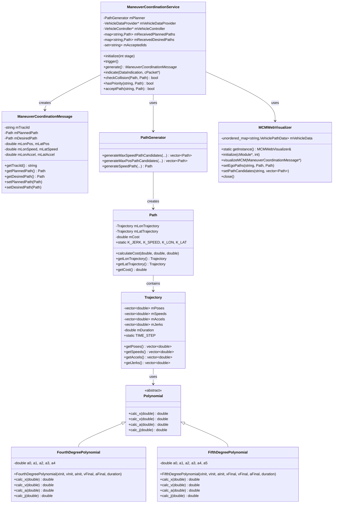
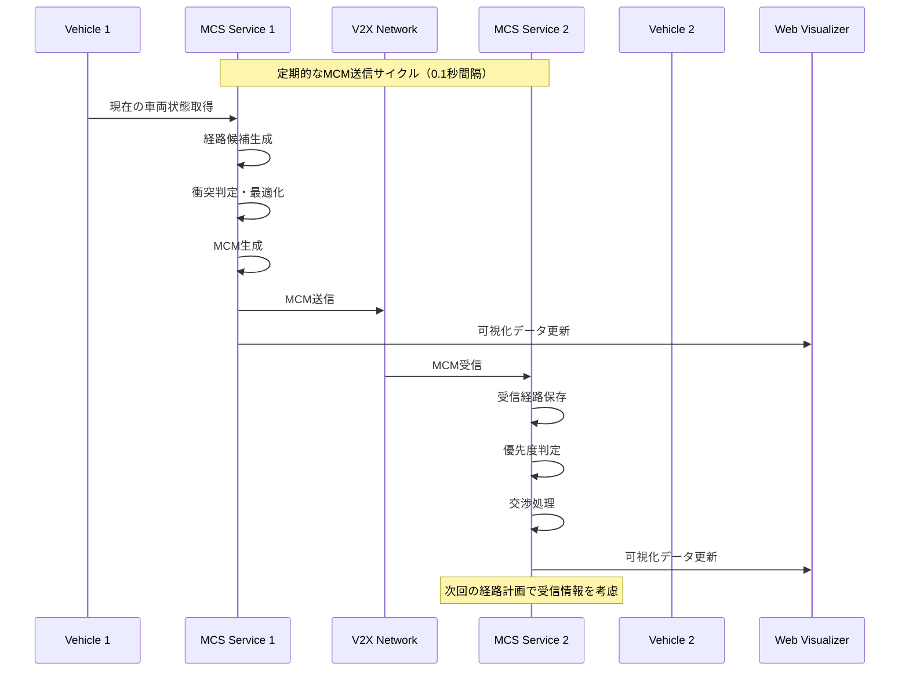
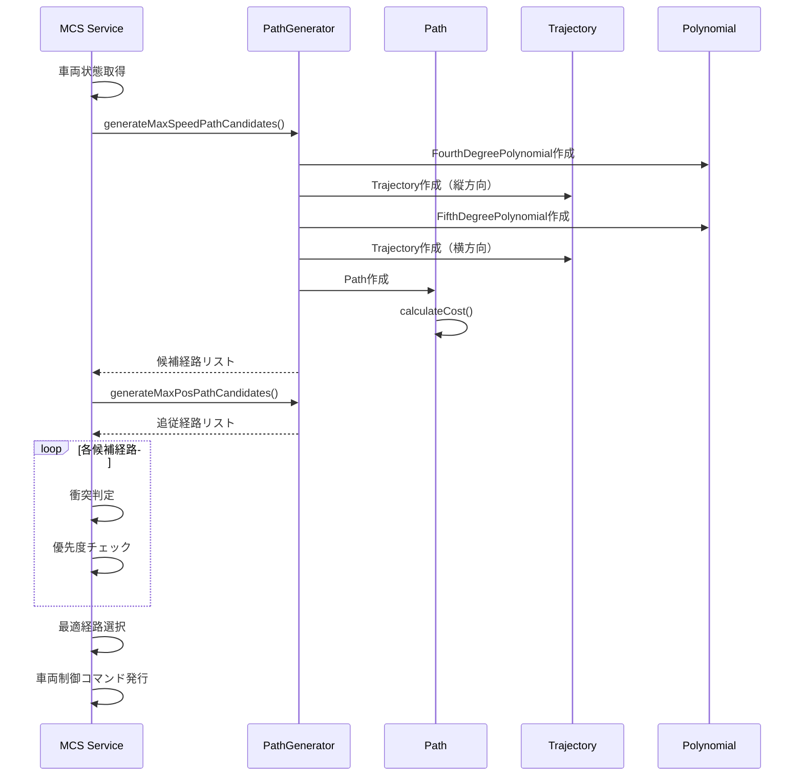

# Maneuver Coordination Service (MCS)

## 概要

Maneuver Coordination Service (MCS) は、車両間で経路情報を共有し、協調的な運転操作を実現するためのV2X（Vehicle-to-Everything）サービスです。各車両は自身の予定経路と希望経路をManeuver Coordination Message (MCM) として送信し、受信した情報を基に衝突回避と最適な経路選択を行います。

### 主な機能

- 車両の現在状態（位置、速度、加速度）の共有
- 予定経路（Planned Path）と希望経路（Desired Path）の生成と送信
- 他車両との衝突判定と回避
- 優先度に基づく経路調整
- リアルタイムでの経路可視化

## システムアーキテクチャ

```
┌─────────────────────────────────────────────────────────────┐
│                    MCS Application Layer                    │
├─────────────────────────────────────────────────────────────┤
│  ManeuverCoordinationService                               │
│  ├── MCM Generation & Processing                           │
│  ├── Path Planning & Optimization                          │
│  ├── Collision Detection                                   │
│  └── Vehicle Control                                       │
├─────────────────────────────────────────────────────────────┤
│  Core Components                                           │
│  ├── PathGenerator        ├── MCMWebVisualizer             │
│  ├── Path & Trajectory    ├── ManeuverCoordinationMessage  │
│  └── Polynomial Classes   └── Configuration (.ned)         │
├─────────────────────────────────────────────────────────────┤
│                    V2X Communication                        │
│                    (VANETZA/ITS-G5)                        │
├─────────────────────────────────────────────────────────────┤
│                    Vehicle Platform                         │
│                    (SUMO/TRACI)                            │
└─────────────────────────────────────────────────────────────┘
```

### レイヤー構成

1. **アプリケーション層**: MCSの主要ロジック
2. **コアコンポーネント層**: 経路生成、可視化、メッセージング
3. **通信層**: V2X通信（VANETZA/ITS-G5）
4. **車両プラットフォーム層**: 車両シミュレーション（SUMO/TRACI）

## クラス図



## シーケンス図

### MCM送信・受信フロー



### 経路計画・最適化フロー



## ファイル構成

```
src/artery/application/mcs/
├── ManeuverCoordinationService.h/.cc      # メインサービス
├── ManeuverCoordinationService.ned        # OMNeT++設定
├── ManeuverCoordinationMessage.h/.cc      # MCMメッセージ
├── PathGenerator.h/.cc                    # 経路生成器
├── Path.h/.cc                            # 経路クラス
├── Trajectory.h/.cc                      # 軌跡クラス
├── Polynomial.h                          # 多項式抽象クラス
├── FourthDegreePolynomial.h/.cc          # 4次多項式
├── FifthDegreePolynomial.h/.cc           # 5次多項式
└── MCMWebVisualizer.h/.cc               # Web可視化
```

## 設定パラメータ

### ManeuverCoordinationService.ned

```ned
parameters:
    double updateInterval @unit(s) = default(0.1s);     // 更新間隔
    double vehicleLength @unit(m) = default(5m);        // 車両長
    int numLanes = default(3);                          // レーン数
    double laneWidth @unit(m) = default(3.2m);          // レーン幅
    double convergenceTime @unit(s) = default(5s);      // 収束時間
    bool enableVisualization = default(true);           // 可視化有効
    int visualizationPort = default(8080);              // 可視化ポート
```

### 主要定数（Path.h）

```cpp
static constexpr double K_JERK = 0.1;      // ジャーク重み
static constexpr double K_SPEED = 5.0;     // 速度重み
static constexpr double K_LON = 1.0;       // 縦方向重み
static constexpr double K_LAT = 1.0;       // 横方向重み
```

## 使用方法

### 1. ビルド

```bash
# mcsディレクトリでの単体テスト
cd src/artery/application/mcs/

# 各コンポーネントのテスト
g++ -DPATH_TEST Path.cc Trajectory.cc FifthDegreePolynomial.cc FourthDegreePolynomial.cc
g++ -DTRAJECTORY_TEST Trajectory.cc FourthDegreePolynomial.cc FifthDegreePolynomial.cc
g++ -DPATHGENERATOR_TEST PathGenerator.cc Path.cc Trajectory.cc FifthDegreePolynomial.cc FourthDegreePolynomial.cc
```

### 2. シミュレーション実行

```bash
# OMNeT++でのシミュレーション実行
omnetpp simulation_config.ini
```

### 3. 可視化

シミュレーション実行中に：

1. プロジェクトディレクトリでHTTPサーバを起動
2. ブラウザで `http://localhost:8080/mcm_visualization/` にアクセス

## アルゴリズム詳細

### 経路生成

1. **自由走行経路**: 各レーンで最高速度に達する経路群を生成
2. **追従走行経路**: 前方車両の位置・速度に基づく追従経路群を生成
3. **直進経路**: 指定速度に達する直進経路を生成

### 衝突判定

- 時系列での位置比較
- 縦方向閾値: 車両長の半分 + 安全距離
- 横方向閾値: レーン幅の半分

### 優先度判定

1. 障害物が最優先
2. 車線変更車両 < 直進車両
3. 同一レーン内では前方車両が優先

### コスト計算

```
総コスト = K_LON × 縦方向コスト + K_LAT × 横方向コスト

縦方向コスト = K_JERK × ジャーク二乗和 + K_SPEED × 速度差二乗
横方向コスト = K_JERK × ジャーク二乗和
```
