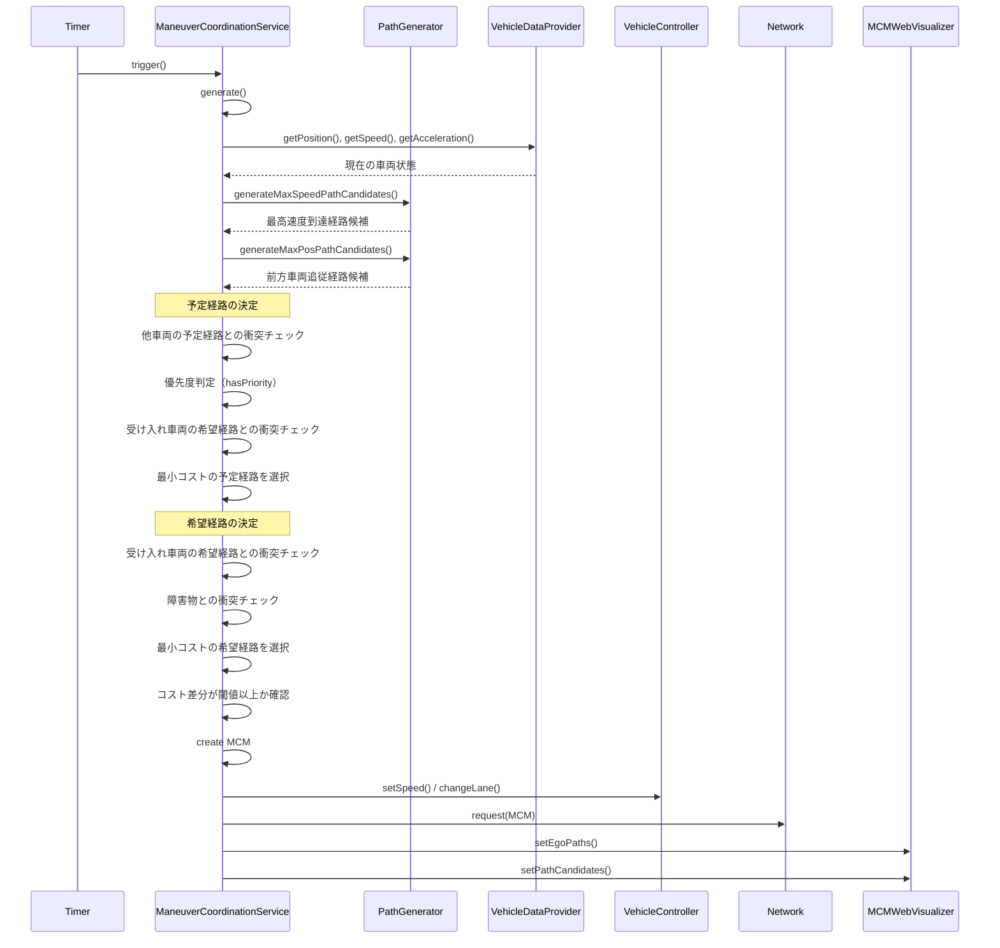
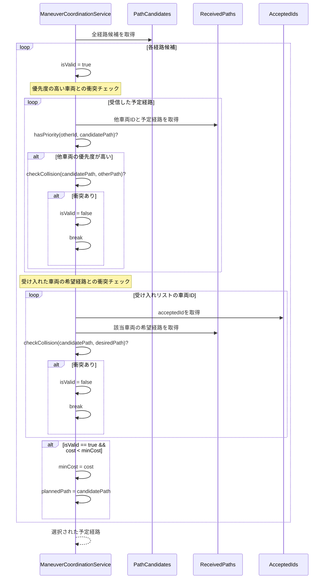
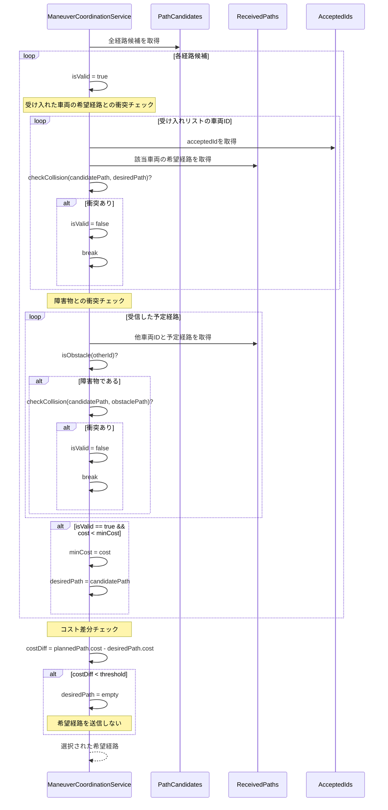

# Maneuver Coordination Service (MCS) ドキュメント

## 1. 概要

Maneuver Coordination Service (MCS) は、車両間で経路情報を共有し、協調的な運転操作を実現するためのV2X（Vehicle-to-Everything）サービスです。各車両は自身の予定経路と希望経路をManeuver Coordination Message (MCM) として送信し、受信した情報を基に衝突回避と最適な経路選択を行います。

### 主な機能
- 車両の現在状態（位置、速度、加速度）の共有
- 予定経路（Planned Path）と希望経路（Desired Path）の生成と送信
- 他車両との衝突判定と回避
- 優先度に基づく経路調整
- リアルタイムでの経路可視化

## 2. システムアーキテクチャ

### 2.1 主要コンポーネント

#### ManeuverCoordinationService
- MCMの生成と送信を管理するメインサービス
- 他車両からのMCMを受信して処理
- 経路の衝突判定と最適化を実行

#### ManeuverCoordinationMessage (MCM)
- 車両間で交換されるメッセージ
- 車両ID、現在状態、予定経路、希望経路を含む

#### PathGenerator
- 様々な条件下での経路候補を生成
- 最高速度到達経路と前方車両追従経路の生成

#### Path & Trajectory
- Path: 縦方向と横方向の軌跡を組み合わせた経路
- Trajectory: 時系列の位置、速度、加速度、ジャーク情報

#### Polynomial (FourthDegreePolynomial, FifthDegreePolynomial)
- 滑らかな軌跡を生成するための多項式
- 境界条件（位置、速度、加速度）を満たす曲線を計算

#### MCMWebVisualizer
- Webブラウザでリアルタイムに経路を可視化
- JSON形式でデータを出力

## 3. クラス図


## 4. シーケンス図

### 4.1 MCM送信プロセス



### 4.2 MCM受信プロセス


### 4.3 経路生成プロセス


### 4.4 予定経路（Planned Path）決定プロセス



### 4.5 希望経路（Desired Path）決定プロセス



## 5. データフロー

### 5.1 MCM (Maneuver Coordination Message) 構造

```
MCM {
    - traciId: 車両識別子
    - plannedPath: 予定経路（他車両との調整済み）
    - desiredPath: 希望経路（理想的な経路）
    - lonPos: 現在の縦方向位置 [m]
    - lonSpeed: 現在の縦方向速度 [m/s]
    - lonAccel: 現在の縦方向加速度 [m/s²]
    - latPos: 現在の横方向位置 [m]
    - latSpeed: 現在の横方向速度 [m/s]
    - latAccel: 現在の横方向加速度 [m/s²]
}
```

### 5.2 Path構造

```
Path {
    - lonTrajectory: 縦方向の軌跡
    - latTrajectory: 横方向の軌跡
    - cost: 経路のコスト値
}

Trajectory {
    - poses[]: 位置の時系列データ [m]
    - speeds[]: 速度の時系列データ [m/s]
    - accels[]: 加速度の時系列データ [m/s²]
    - jerks[]: ジャークの時系列データ [m/s³]
}
```

## 6. アルゴリズム詳細

### 6.1 経路コスト計算

経路のコストは以下の要素から計算されます：

```
Cost = K_LON × (縦方向コスト) + K_LAT × (横方向コスト)

縦方向コスト = K_JERK × Σ(jerk²) + K_SPEED × (目標速度との差)²
横方向コスト = K_JERK × Σ(jerk²)
```

### 6.2 衝突判定

2つの経路が衝突するかどうかは、各時間ステップでの車両間距離で判定：

```
縦方向閾値 = 車両長 / 2 + 安全マージン
横方向閾値 = レーン幅 / 2

if (|Δ縦位置| < 縦方向閾値 AND |Δ横位置| < 横方向閾値) then
    衝突あり
```

### 6.3 優先度判定

以下の条件で優先度を決定：
1. 障害物は最高優先度
2. 車線変更時は、変更先レーンの車両が優先
3. 同一レーンでは前方車両が優先

### 6.4 多項式軌跡生成

#### 4次多項式（速度制御用）
- 境界条件：初期位置、初期速度、初期加速度、最終速度、最終加速度
- 用途：縦方向の速度変更

#### 5次多項式（位置制御用）
- 境界条件：初期位置、初期速度、初期加速度、最終位置、最終速度、最終加速度
- 用途：横方向の車線変更、縦方向の位置制御

## 7. 可視化システム

MCMWebVisualizerは、以下の情報をJSON形式で出力：
- 各車両の現在位置と速度
- 予定経路（plannedPath）
- 希望経路（desiredPath）
- 候補経路（pathCandidates）

ブラウザで `http://localhost:8080/mcm_visualization/` にアクセスすることで、リアルタイムで経路を確認できます。

## 8. パラメータ設定

主要なパラメータ：
- `laneWidth`: レーン幅 [m]
- `numLanes`: レーン数
- `vehicleLength`: 車両長 [m]
- `convergenceTime`: 経路収束時間 [s]
- `safetySecond`: 安全時間間隔 [s]
- `laneChangeInterval`: 車線変更後の待機時間 [s]
- `desiredCostThreshold`: 希望経路送信の閾値

## 9. 使用例

### 9.1 サービスの初期化

```cpp
// OMNeT++の設定ファイル（.ned）で定義
*.node[*].middleware.services = "ManeuverCoordinationService"
*.node[*].middleware.ManeuverCoordinationService.laneWidth = 3.5
*.node[*].middleware.ManeuverCoordinationService.numLanes = 3
*.node[*].middleware.ManeuverCoordinationService.convergenceTime = 5.0
```

### 9.2 経路生成の例

```cpp
// 最高速度到達経路の生成
std::vector<Path> speedPaths = mPlanner.generateMaxSpeedPathCandidates(
    lonPos, lonSpeed, lonAccel,
    latPos, latSpeed, latAccel,
    maxSpeed, laneCenterPositions, mConvTime
);

// 前方車両追従経路の生成
std::vector<Path> followPaths = mPlanner.generateMaxPosPathCandidates(
    lonPos, lonSpeed, lonAccel,
    latPos, latSpeed, latAccel,
    leadingPositions, leadingSpeeds, maxSpeed,
    leadingLatPositions, mConvTime
);
```

## 10. まとめ

MCSは、V2X通信を活用して車両間の協調的な運転を実現するシステムです。各車両が自身の意図（経路）を共有し、相互に調整することで、安全で効率的な交通流を実現します。滑らかな軌跡生成、リアルタイムの衝突判定、優先度に基づく調整により、自動運転車両の協調動作を支援します。
